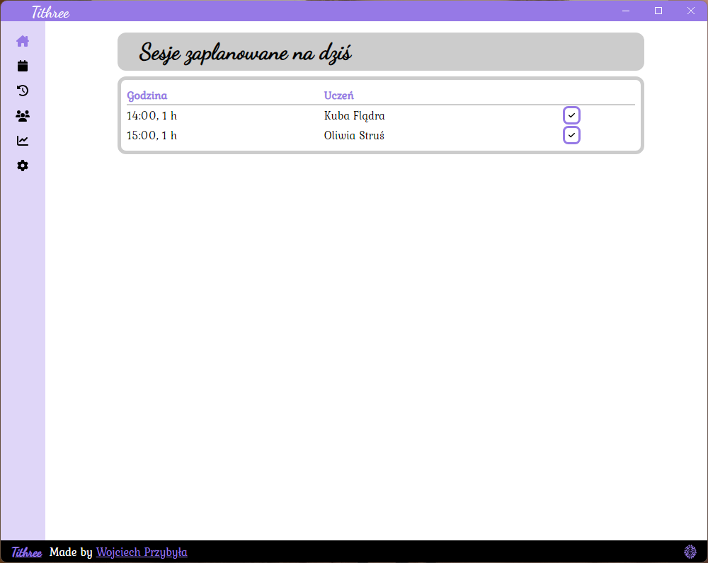
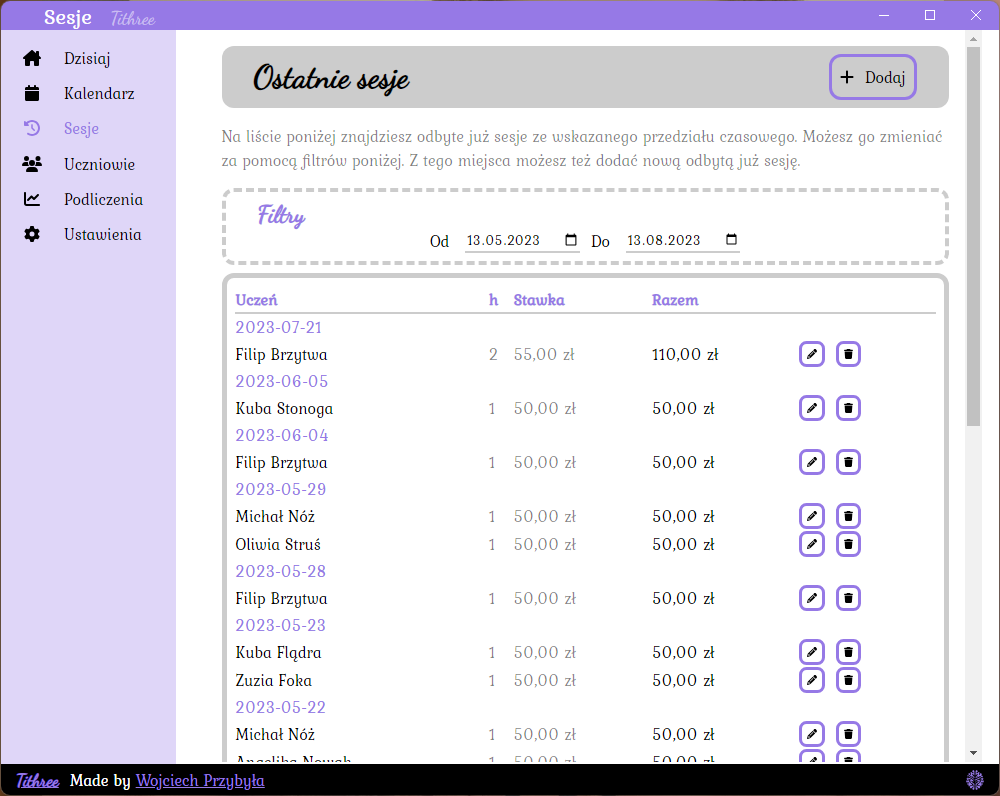
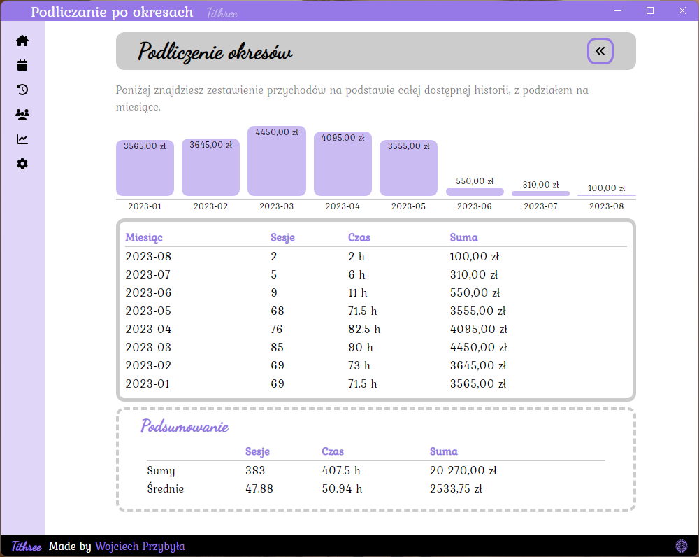
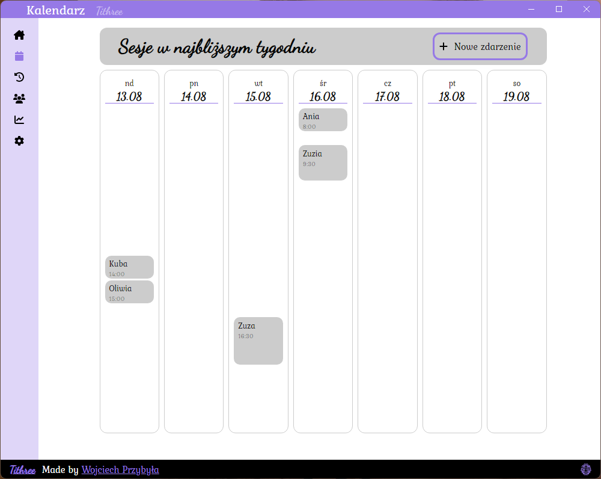

This is an app which serves as an aid for a tutor 🧑‍🏫 It tallies how much time ⏰ is spent with students and how much money 💸 is earned based on that.

Made with __Vue__ and shipped to standalone app with __Electron__, motivated by my beloved 💝

## Features
- 🧑‍🎓 managing student data
- ✏️ writing sessions' duration and value
- 📈 tallying money and time, and neat plots
- ⚙️ customisable colors
- 📅 Google Calendar integration (limited but working!)

## Screenshots
This app is constantly improving and will probably change in the near future. More screenshots can be found in the [dedicated folder](/_screenshots/).

## Dev things
- `npm run watch` - start development version
- `npm run compile` - build and create an installer
